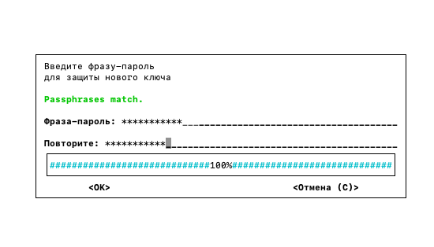
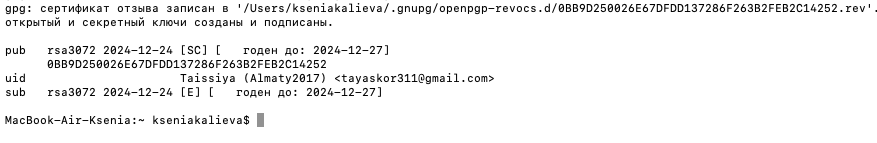
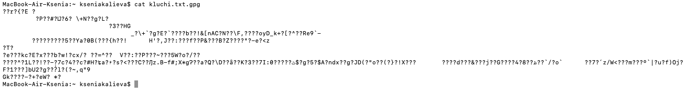
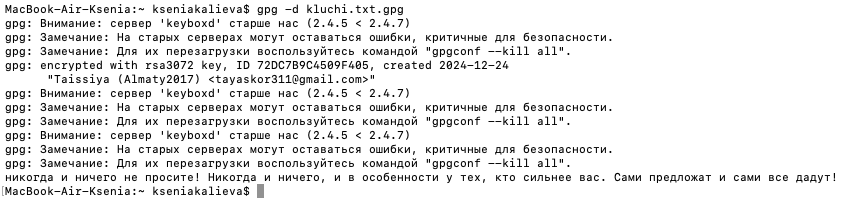

# Лабораторная работа (решение)
# Шифрование с помощью ключей

Для начала устанавливаем утилиту GPG через терминал, затем приступаем к шифрованию.

1. Создаём файл `touch kluchi.txt`
2. Записываем в него строчки из произведения "Мастер и Маргарита"
3. Реализуем шифрование файла

- Для создания пары ключей вводим команду: `gpg --full-generate-key`
  
Вводим тип ключа, размер ключа (3072 бит), срок действия ключа, идентификатор пользователя. Придумываем фразу-пароль для защиты нового ключа:

- Увидеть созданный доступный ключ можно с помощью команды: `gpg –list-keys`

- Для шифрования вводим команду: `gpg -e -r Taissiya kluchi.txt`, где `Taissiya` - это созданный при генерации ключа идентификатор пользователя
  
- В директории с исходным файлом будет создан файл с расширением gpg, попробуем вывести его содержимое и просмотрим на результат шифрования:

4. Реализуем дешифрование

- С помощью команды `gpg -d имя_файла.gpg` расшифруем файл
- Далее вводим фразу-пароль, установленную ранее
- После этого в терминале отобразится исходное содержимое файла (а именно текст из произведения), то есть результат дешифрования:

# Источники, где можно найти информацию для выполнения работы:
[Шифрование и утилита GPG](https://habr.com/ru/articles/659755/)

[Источник, где можно найти ВСЁ](https://www.google.ru/?hl=ru)

